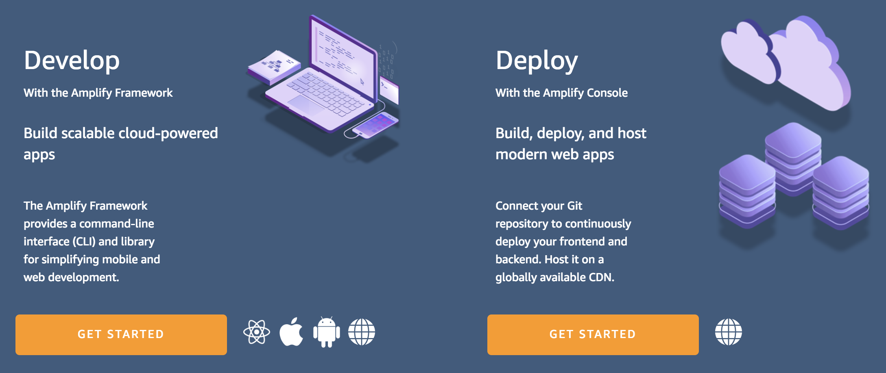
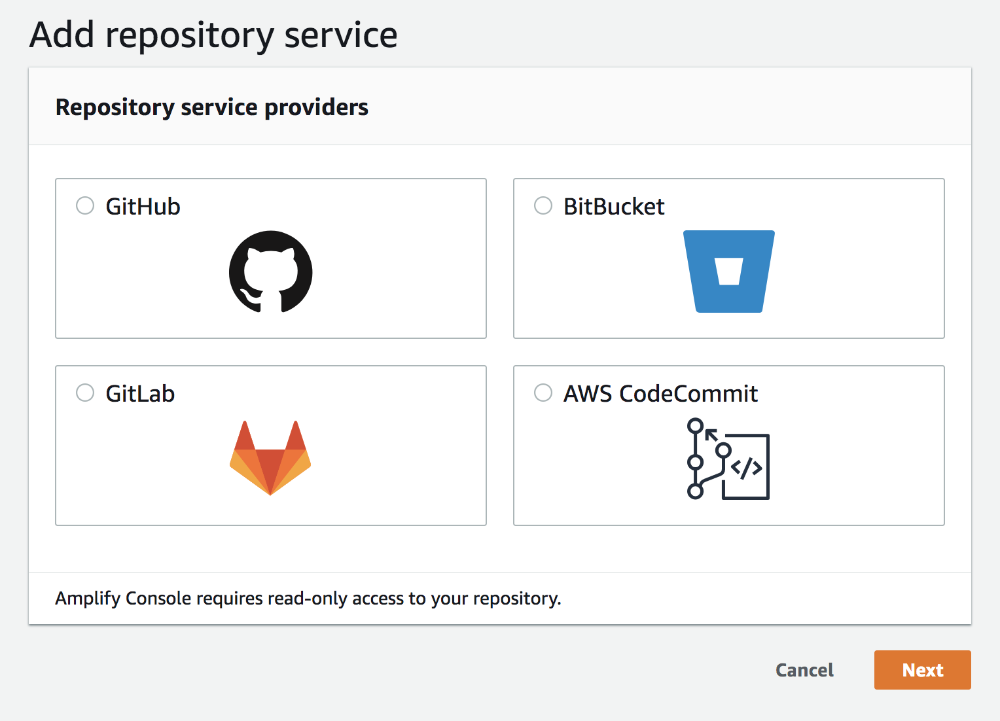
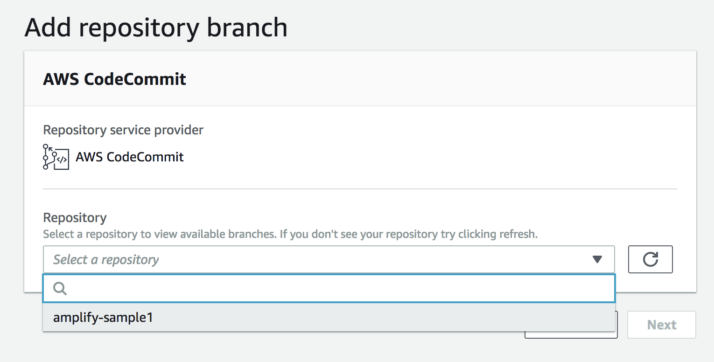

# Module 1 - Deploying your first App

In this module we will deploy our first app with Amplify Console. The first sample app that we will deploy is a very basic static website. This will help us to understand the basic workflow of Amplify Console.

## Module 1A - Deploying your App

First we need to navigate to the AWS Amplify Console. You will see that AWS Amplify consists of two parts. 

- **Develop / Amplify Framework** -  a front-end javascript library for adding backend resources to your modern applications
- **Deploy / Amplify Console** -  a cloud service that manages continuous deployment and hosting of modern web applications

1. This workshop will be focusing on the Deploy side of the Amplify offering, so select "Getting Started" on the right.

2. This should take you straight into the "Create App" Wizard. On the initial page, select AWS CodeCommit as your code repository.

    

3. You should now be able to select your **amplifysample1** repository in AWS CodeCommit from the dropdown. And then select the **master** branch.

    *Note: If you do not see your repo here, ensure you are using Amplify in the same region as your respository is hosted.*

    

4. On the next step we will configure the build settings. As this is a simple static site, we do not need to run any build commands. We can accept the defaults here.

    One thing to note is that Amplify Console has detected that this is a Web App as shown below. This is a basic example, but Amplify Console is also aware of some Single Page App (SPA) frameworks (for example, React, Angular, or Vue) and static-site generators (SSGs) (for example, Hugo, Jekyll, or Gatsby). As well as the [AWS Amplify Framework](https://aws-amplify.github.io/).

    When using one of these SPA frameworks and SSGs, you will see that Amplify detects the framework and will auto-create Build settings for you.

5. Select next to move onto the summary screen. Review the configuration and select **"Save and Deploy"** to deploy your application.

## Module 1B - Reviewing your deployment

Once your deployment has started you will be taken to the main page for managing your application inside AWS Amplify Console. You will see that your application has one environment, **master**, that will take a few minutes to deploy.

This is a good opportunity to get familiar with the Amplify Console and look into the kind of information that the service provides. 

1. Click on the "Provision" circle in the build timeline, you can see the logs for each stage of the deployment process. 

2. As the application is deployed, the other logs will become available for the Build, Deploy and Verify Stages of the application. Wait a minute or two to see the app move through the stages. This will give you a look at what Amplify Console is deploying for your application. 

3. Make sure to take a look at the **Verify** stage which has a feature that shows how your homepage will render on a handful of mobile devices. This is a nice way to quickly visually verify if the homepage at least has deployed as expected.

4. The application should take just over 2mins to deploy, once deployment is complete, head back to the main application page and you will see a unique URL for you to visit your application. Your deployed site will open in a new tab/window and should look like the below.

    

    *NOTE: As mentioned on the main README for this Workshop. We will not be covering custom domains in this workshop due to time. We reccomend using Route53 for DNS, this makes its a one-click process to add a custom domain to your application.*

Congratulations on deploying your first AWS Amplify Console app. You are now ready to move onto Module 2.

