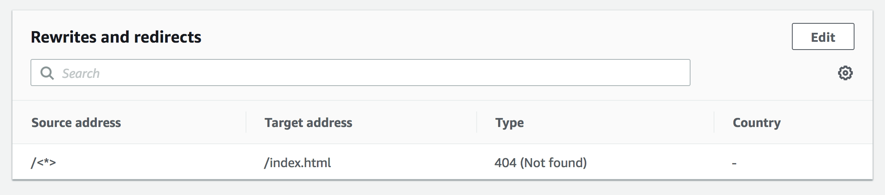
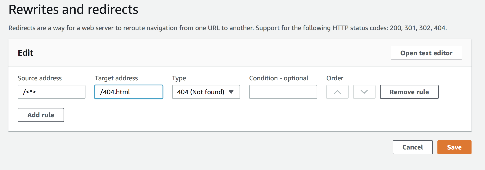
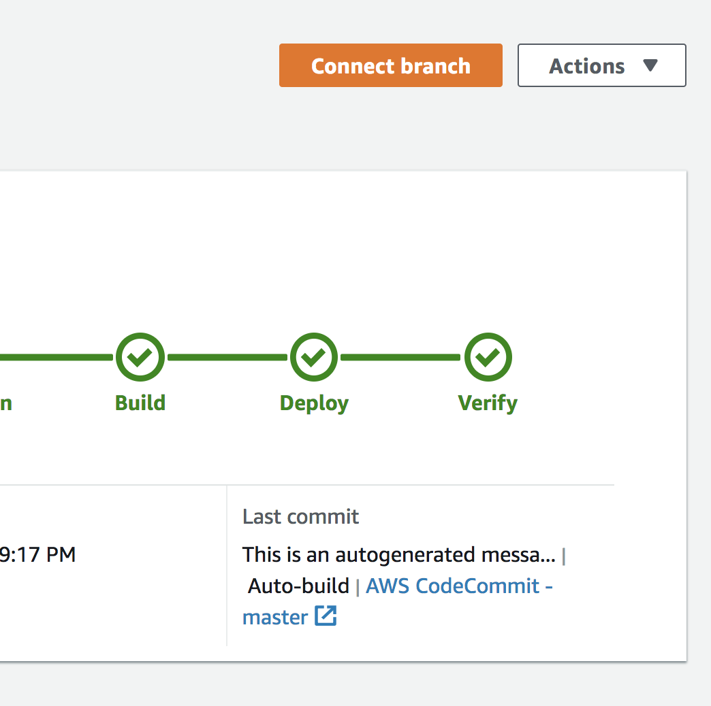
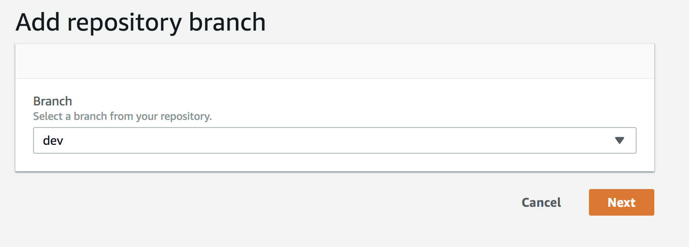
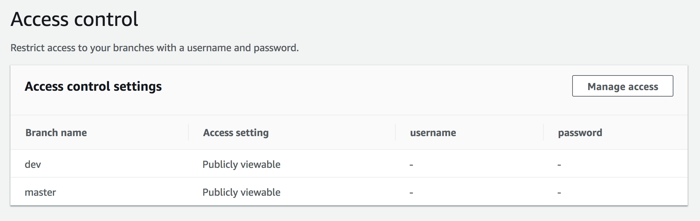
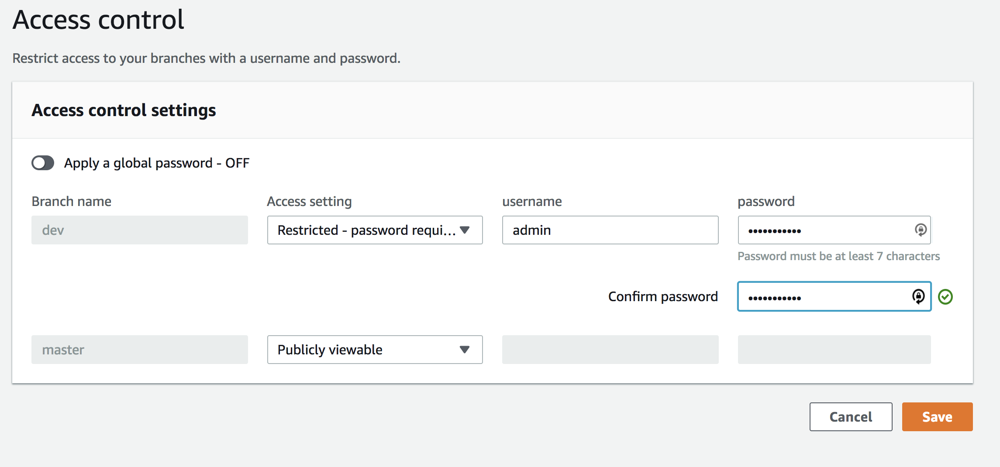
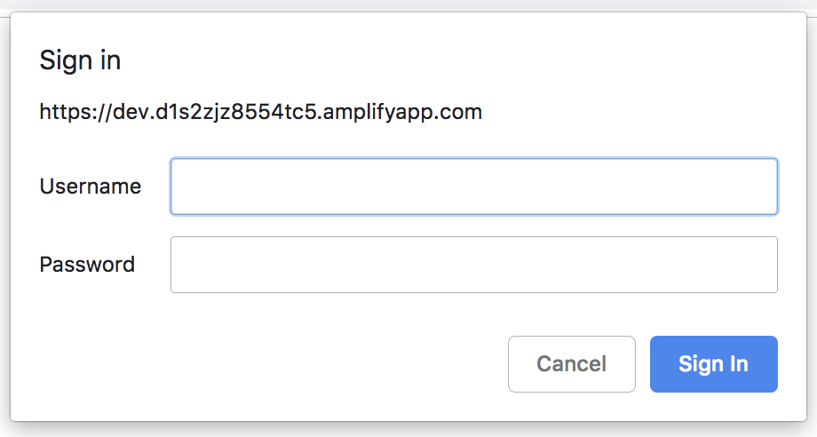

# Module 2 - Managing Environments

In this module we will cover adding an additional environment to your existing application. Amplify console allows you to create separate environments by leveraging git branches. We will also show some additional Amplify Console features such as Redirects and Access Control.

## Module 2A - Using Redirects
Before we deploy a secondary application environment we will quickly cover rewrites and redirects. Common reasons for using redirects include: to customize the appearance of URL, to avoid broken links, to move the hosting location of an app or site without changing its address, and to change a requested URL to the form needed by a web app.

Our site is OK, but we have realised that our links do not work. Amplify console handles this with a default redirect. All pages that are not found (404) are redirected back to index.html. Open your application and test this by selecting one of the links in the Navigation Pane. You can control this feature, and other redirect rules in the "Rewrites and Redirects" section of the console.



This stops our users getting any HTTP errors, but when this happens we would prefer to present a simple error page. You will see a file named 404.html in the root of the code repository. We can use this page to tell our users that something went wrong, rather than redirecting them back to the homepage. 

1. To configure this, select the **"Edit"** button in the Redirects panel.

    We do not need to add a new rule, but we will edit the existing rule and change the target address for any 404 (Not Found) HTTP responses to our error page at 404.html.

    

2. Save the changes, and navigate back to your application in the browser. Select one of the links in the Nav Panel and you should now be redirected to the 404.html page.

    

## Module 2B - Creating a Dev environment

We have some additional features that we would like to add to our site, the first feature is to add an About page, because currently our link points to nowhere. We will use Amplify Console to manage multiple environments, these could be various feature branches, but for simplicity we will create one generic Dev branch for these changes.

1. Make sure that you are in the `amplify-console-workshop/amplifysample1` directory.

2. Create a new git branch of your application

    ```
    $ git checkout -b dev
    Switched to a new branch 'dev'
    ```
    
3. Create your *about.html* file.

    ```
    $ echo "I am learning about AWS Amplify Console through <a href="https://github.com/stevenbryen/amplify-console-workshop">AWS Amplify Workshop</a>" >> about.html
    ```

4. Now lets push to our remote repository and create a new Dev branch in CodeCommit.

    ```
    $ git add .
    $ git commit -m "created about page"
    $ git push origin dev
    ```
    
5. Now we have our new remote branch navigate back to the Amplify Console and select your amplifysample1 application. Select "Connect Branch" from the top right of the console.

    


6. You should see the new "dev" branch available in the console.

    


7. Continue through the next few steps as before, accepting the default Build Settings and deploying your app. You will now see two environments deployed in the console. 

    **NOTE: Whilst your app deploys, you can skip to Module 2C as this can be started whilst you wait for deployment to complete.**

8. Once your dev environment is deployed, navigate to the URL for the environment and you should be able to click through to the about.html page using the navigation links.

## Module 2C - Managing Access Control

We now have a development environment, but we still have work to do on styling our About page before we want is publicly available. Amplify offers a basic feature that allows us to add user/pass in front of select environments to restrict public access.


1. Navigate to the "Access Control" section of the console using the Navigation pane. 

2. Select the "Manage Access" option to configure per environment.

    

3. For our dev branch, we will change the ***Restricted - Password Required*** and enter a username along with a complex password. you should be prompted to confirm the password.

    
    
4. Once your dev environment is deployed, navigate to the URL provided and you should see that your dev branch is now restricted by user/password authentication.
    
    

You are now ready to move to Module 3.