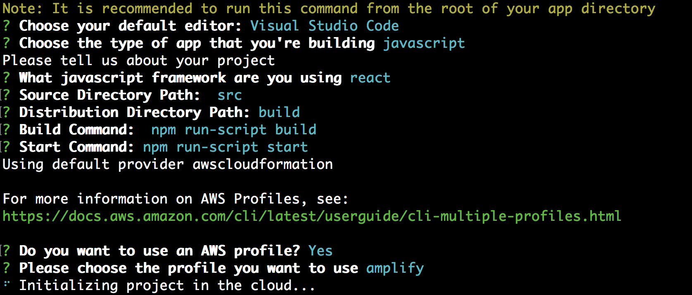
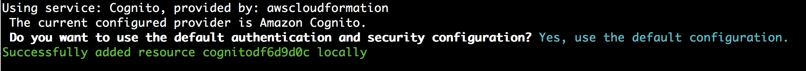
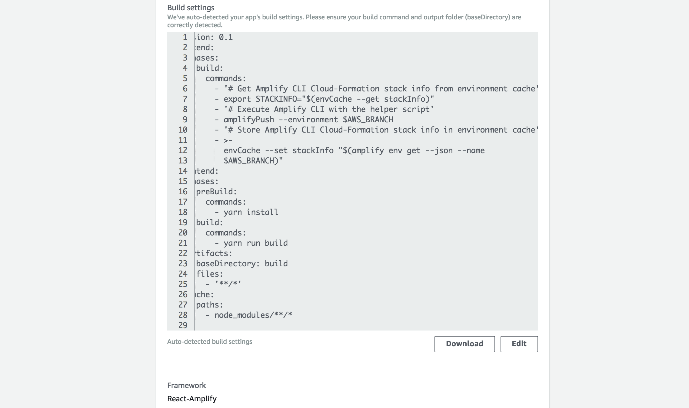
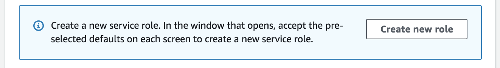

# Module 3 - Deploying Backend with your Frontend

In this module we will deploy a more complex React web application that leverages the AWS Amplify Framework to create some back-end resources for us. We will use a sample Amplify Framework app that leverages AWS Cognito, AWS AppSync and DynamoDB.

***NOTE: The ability to deploy your backend resources along with your frontend is currently in BETA***

### Prerequisites

- Node.js
- NPM

## Module 3A - Setting up Amplify CLI

1. As this feature is in beta, we need to use the beta version of the AWS Amplify CLI. You can install it as below.
    
    ```
    $ npm install -g @aws-amplify/cli@multienv
    ```
    
2. Run `amplify configure` 
    
    This will take you through the process of creating an IAM user, and configuring a new profile in the AWS CLI that Amplify will use.

## Module 3B - Deploying Backend reosources with AWS Amplify

1. Firstly we need to make sure we are working in the directory of or **amplifysample2** application

    ```
    $ cd ../amplifysample2
    ```

2. Initialise an AWS Amplify Project. You will need to answer a few questions. Please use the answers below (you can change he default editor). We are building a **javascript** and **react** application, with the code in the **src** directory. 

   When prompted for the Profile that you wish to use, select the AWS CLI profile you set up in Step 1 earlier.

    ```
    $ amplify init
    ```

    

3. Add Authentication to our App using Amplify CLI. This workshop will not go deep into the Amplify Framework, but this will create the necesarry backend resources to add a user pool in AWS Cognito for users to register and authenticate with our application.

    ```
    $ amplify add auth
    ```
    

    The AWS Amplify CLI will create an Amazon Cognito User Pool and Identity Pool. The sample uses AWS Amplify to perform the Sign-Up and Sign-In flows with a Higher Order Component.
    
4. Check in our updated code to CodeCommit.

    ```
    $ git add .
    $ git commit -m "added authentication resources"
    $ git push origin master
    ```

5. Now navigate to the AWS Amplify console and connect a new application from the main page. We will link our **CodeCommit** repo **amplifysample2**, there should only be one master branch available.

6. When we get to the Build Settings section, we should now see that Amplify console has detected this is a React-Amplify Project and has added the necessary build commands to deploy the backend for you. More details on this can be found [here](https://docs.aws.amazon.com/amplify/latest/userguide/deploy-backend.html).

    

7. As we are deploying backend resources, we now need to configure an IAM role with wider permissions for the Amplify Console to do this. For the same of this demo we will use the  "Create a new Role" button to create a new role and accept the defauls provided.

    
    
8. On the next screen, confirm your settings and select "Save and Deploy".

9. Your application will take a little longer to deploy. To get a look at what the Amplify Framework is doing under the hood, visit the CloudFormation console to see what resources are being created.
    
    If your app has been deployed successfully, you should see a login screen when you visit the app URL. Sign up with a user, make sure to use a real email as a verification code will be sent to you via email to confirm the account. Log In using the newly created account to see the restricted content.
    
    
    
Congratulations! You have just deployed both frontend and backend resources onto AWS using Amplify Console.

This is the last step in this short workshop, to dive deeper into Amplify console features such as custom build settings, custom domains etc take a look at the [Amplify Console Documentation](https://docs.aws.amazon.com/amplify/latest/userguide/welcome.html).

Now we can move to Module 4 - Resource Cleanup.

