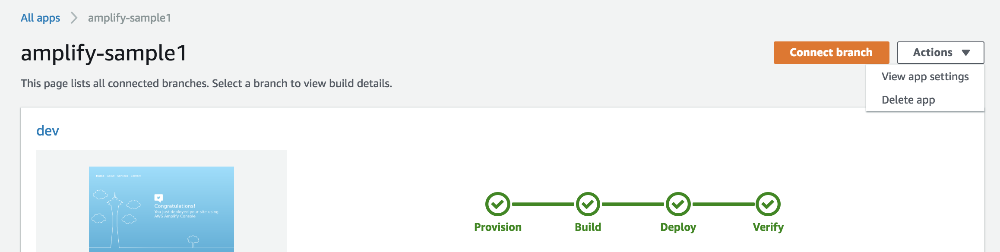
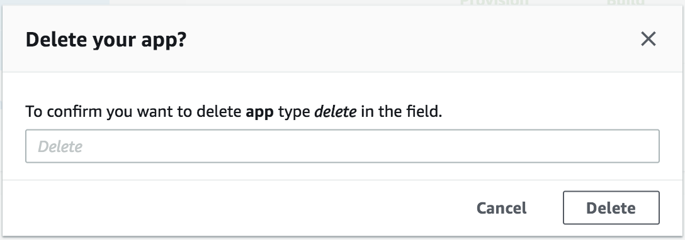
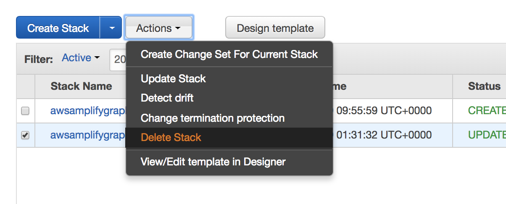
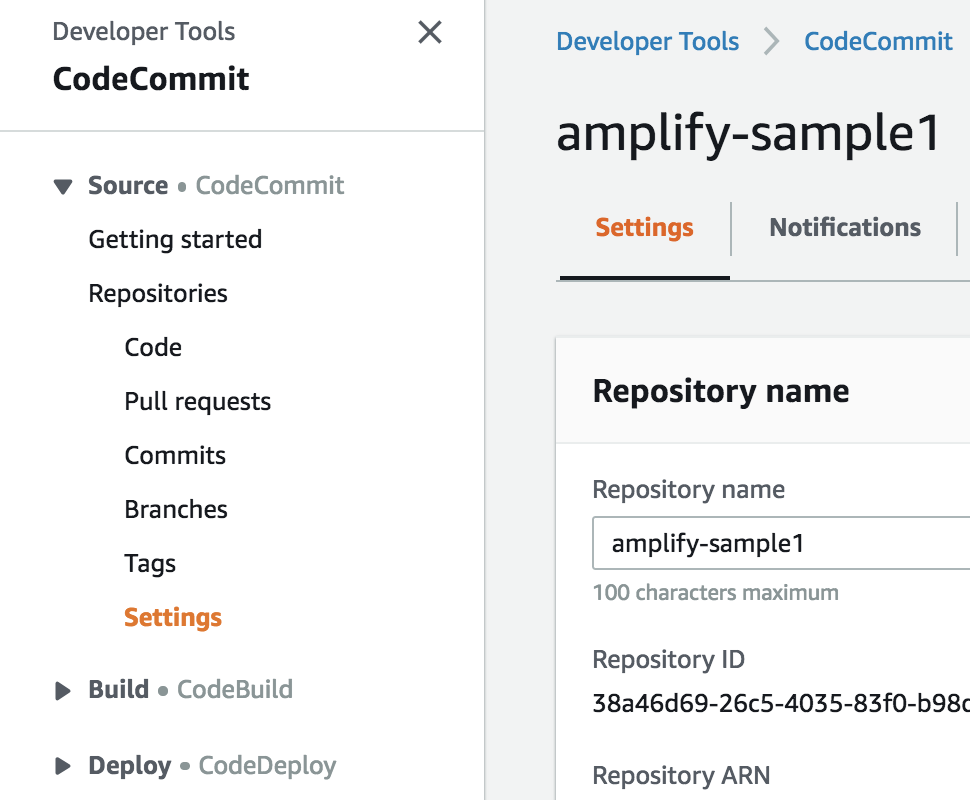
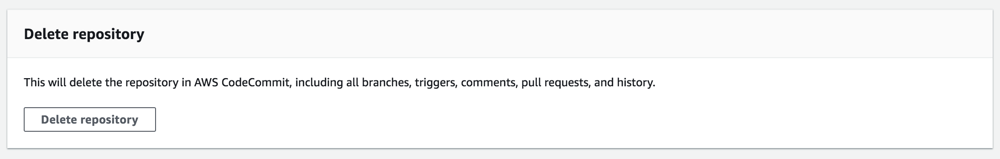

# Module 4 - Resource Cleanup

You have now completed the Amplify Console Workshop. To clean up AWS resources and save any additional costs on your AWS Bill please follow the steps below.

### Amplify Console Apps

1. In the Amplify Console navigate to the main page for each of your two sample applications. In the top right select "Actions" > "Delete App".

    

2. You will be prompted to confirm deletion of the app by typing the word 'delete' and finalising deletion.

    

    This will be enough to remove the whole of **amplifysample1**, however for our backend resources created by the **amplifysample2** application we will need to complete one more step to remove those resources.
    
### Backend CloudFormation Resources
    
3. From the main AWS Console navigation, head to the **AWS Cloudformation** console.
    
    You will see two Cloudformation stacks that have been created by the AWS Amplify Framework. One is the parent stack, and the other a nested stack. The nested stack will be clearly labelled.
    
    

4. We need to delete the parent stack. Select the parent stack and then "Actions" > "Delete Stack".

    
    
5. Confirm deletion and within a few minutes both stacks should show as DELETED.

### CodeCommit Repos

6. Head over to the AWS CodeCommit Console and select your **amplifysample1** repositiory to view it.

7. On the left hand navigation, navigate to the Settings section.

    

8. Scroll to the bottom of the settings page and select "Delete Repository". Confirm deletion.
    
    

All of the resources used in this workshop should now be cleaned up and removed from your AWS Account.

